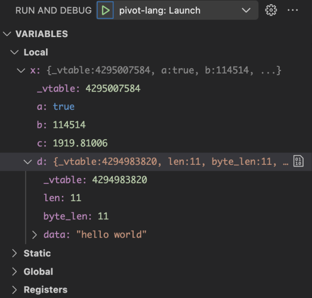
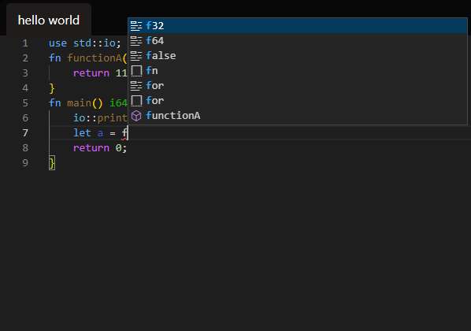

# Pivot Lang

[](https://codecov.io/gh/Pivot-Studio/pivot-lang)
[](https://github.com/Pivot-Studio/pivot-lang/actions/workflows/release.yml)
[](https://github.com/Pivot-Studio/pivot-lang/actions/workflows/test.yml)


此项目目前处于早期开发阶段，不建议用于生产环境。  
[项目地址](https://github.com/Pivot-Studio/pivot-lang)  

## 安装

见[此处](https://lang.pivotstudio.cn/docs/tutorial/installation.html)

## 官网

[https://lang.pivotstudio.cn](https://lang.pivotstudio.cn)

## CONTRIBUTING

[CONTRIBUTING](CONTRIBUTING.md)｜[贡献代码](https://lang.pivotstudio.cn/docs/CONTRIBUTING-CN.html)

欢迎加入: [QQ群](http://qm.qq.com/cgi-bin/qm/qr?_wv=1027&k=nlRLeRcRfr0SxXcLYsjsXobP6X7EeV_c&authKey=rdyEXtc0uMqjYS4i%2FJapoi7CUdwtKgtK5V8Xv0WKgIIb9n4ZkFaIo9mgkflqV%2Frf&noverify=0&group_code=688301255) [discord](https://discord.gg/gukXNPGK)

## dependencies

- [llvm-16](https://github.com/llvm/llvm-project/releases/tag/llvmorg-16.0.0)
- [rust](https://www.rust-lang.org/)

**重要**：如果你想参与开发，请先在项目目录`make vm install`，然后根据自己是linux还是mac运行`make devlinux`或者`make devmac`

## 特点

- 支持静态编译与JIT
- 极其方便的Rust互操作
- 支持debug
- 支持lsp，自带[vsc插件](https://github.com/Pivot-Studio/pivot-lang-support)，能提供优秀的代码支持
- 有GC，自动管理内存
- 强大的类型推断，支持省略大部分类型标注

## 一些ShowCases

### [Ray Tracing in One Weekend in Pivot Lang](https://github.com/Pivot-Studio/rtweekend-pl)

使用Pivot Lang实现的简单光追


### 编辑器支持





### Hello World

```pivot
fn main() i64 {
    println!("hello world!");
    return 0;
}
```

### HashTable

（没错，我们的哈希表源码也是完全用Pivot Lang写的）

```pivot
use std::cols::hashtable;
use core::panic::assert;
use core::eq::*;

fn main() i64 {
    let table = hashtable::new_hash_table(10 as u64, 1 as u64);
    table.insert("hello","world");
    table.insert("bye","bye");
    assert(table.get("hello") is string);
    let v = table.get("hello") as string!;
    assert("world".eq(&v));
    return 0;
}

```

### Fibonacci

```pivot
use std::io;
fn main() i64 {
    let result = fib(10);
    println!(result);
    return 0;
}

fn fib(n: i64) i64 {
    let pre = 0;
    let nxt = 0;
    let result = 1;
    for let i = 0; i < n; i = i + 1 {
        result = result + pre;
        pre = nxt;
        nxt = result;
    }
    return result;
}

```

### Y组合子

```pivot
use core::panic;
pub fn main() i64 {
    let g = |f, x| => {
        if x == 0 {
            return 1;
        }
        return x * f(x - 1);
    };
    let fact = Y(g);
    for let x = 0; x < 10; x = x + 1 {
        panic::assert(fact(x) == fact_recursion(x));
    }
    return 0;
}


struct Func<A|F> {
    f: |Func<A|F>, A| => F;
}

impl<A|F> Func<A|F> {
    fn call(f: Func<A|F>, x: A) F {
        return self.f(f, x);
    }

}

fn Y<A|R>(g: ||A| => R, A| => R) |A| => R {
    // 下方代码的类型推断是一个很好的例子
    return |x| => {
        return |f, x| => {
            return f.call(f, x);
        }(Func{
            f: |f, x| => {
                return g(|x| => {
                    return f.call(f, x);
                }, x);
            }
        }, x);
    };
}

fn fact_recursion(x: i64) i64 {
    if x == 0 {
        return 1;
    }
    return x * fact_recursion(x - 1);
}


```
