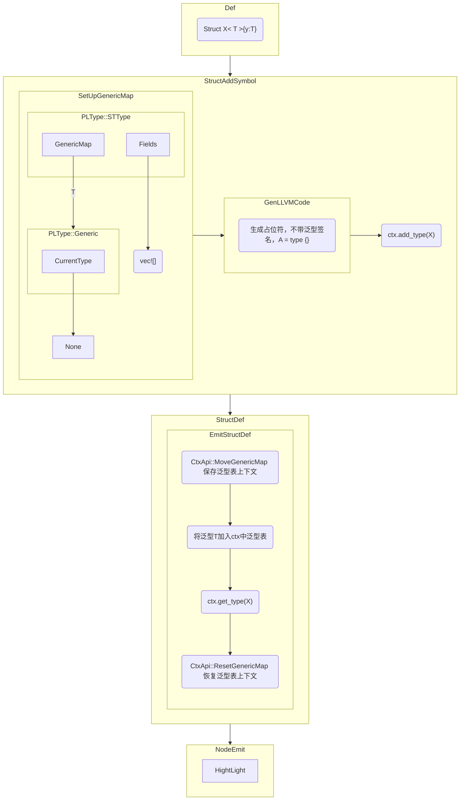
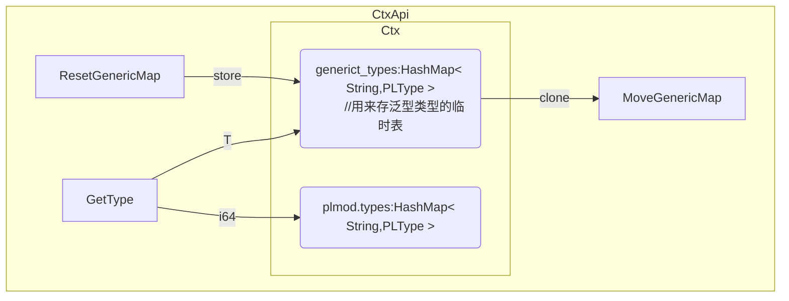
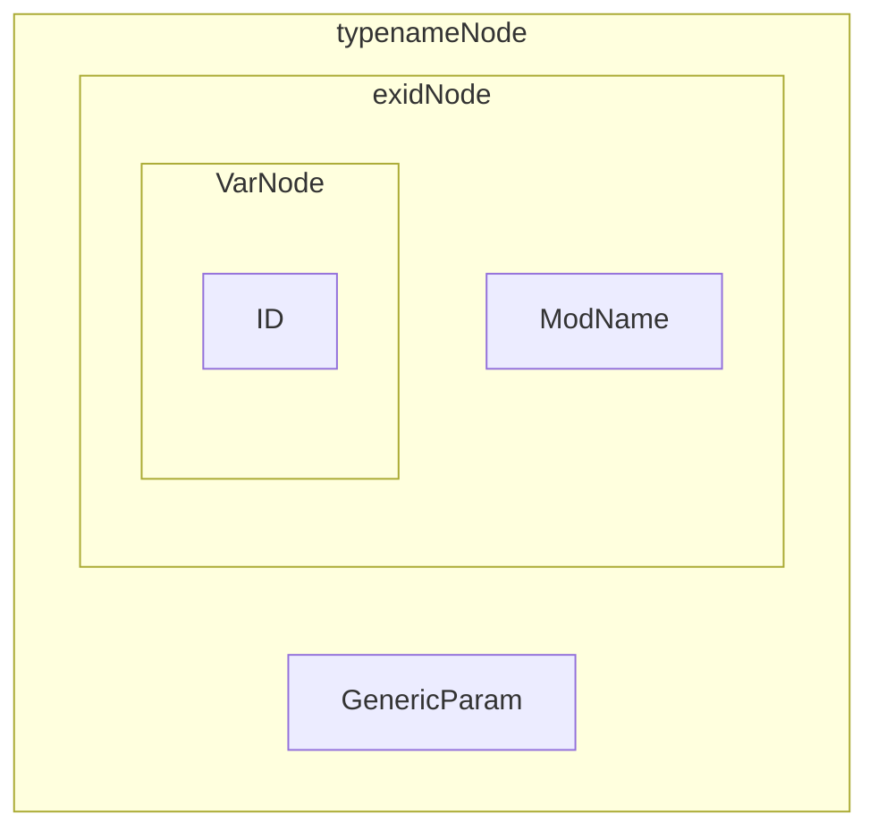

# Generic

```mermaid
graph TD
    Def-->StructAddSymbol-->StructDef-->NodeEmit  
    subgraph Def
        DefStruct("Struct X< T >{y:T}")
    end
    subgraph StructAddSymbol
        %% SetUpGenericMap
        subgraph SetUpGenericMap
            subgraph PLType::STType
                GenericMap
                Fields
            end
            subgraph PLType::Generic
                CurrentType
            end
            None
            EmptyVec("vec![]")
            CurrentType-->None
            Fields-->EmptyVec
            GenericMap--T-->PLType::Generic
        end
        %% GenLLVMCode
        subgraph GenLLVMCode
            Code("生成占位符，不带泛型签名，A = type {}")
        end
        AddType("ctx.add_type(X)")
        SetUpGenericMap-->GenLLVMCode-->AddType
    end

    subgraph StructDef
        Move(CtxApi::MoveGenericMap 保存泛型表上下文)
        Reset(CtxApi::ResetGenericMap 恢复泛型表上下文)
        AddGeneric(将泛型T加入ctx中泛型表)
        GetType("ctx.get_type(X)")
        subgraph EmitStructDef
            direction TB
            Move-->AddGeneric-->GetType-->Reset
        end
    end

    subgraph NodeEmit
        HightLight
    end
    
```

```mermaid
graph TD
    subgraph CtxApi 
        subgraph Ctx
            GenericTypesMap("generict_types:HashMap< String,PLType >
        //用来存泛型类型的临时表")
            PLMod::types("plmod.types:HashMap< String,PLType >")
        end
        GenericTypesMap--clone-->MoveGenericMap
        ResetGenericMap--store-->GenericTypesMap
        GetType--T-->GenericTypesMap
        GetType--i64-->PLMod::types
    end
```

```mermaid
graph TD
    subgraph typenameNode
        GenericParam 
        subgraph exidNode
            ModName
            subgraph VarNode
                ID
            end
        end
    end
```
PLType::STType {
    field: {
        PLType::STType
    }
}