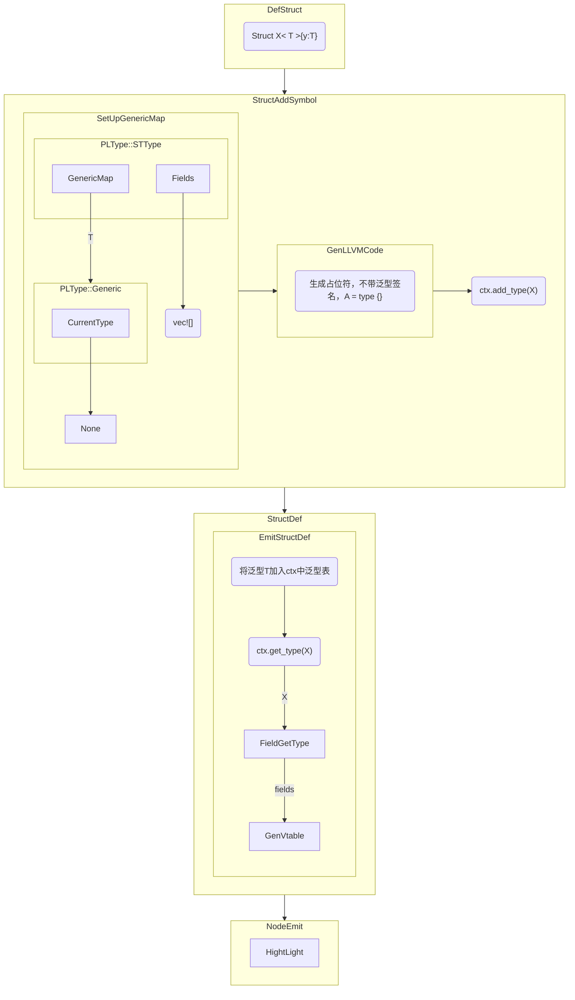
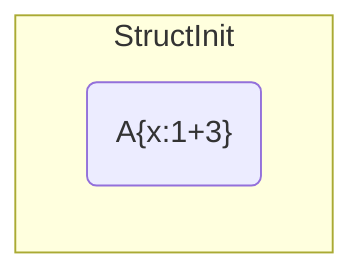
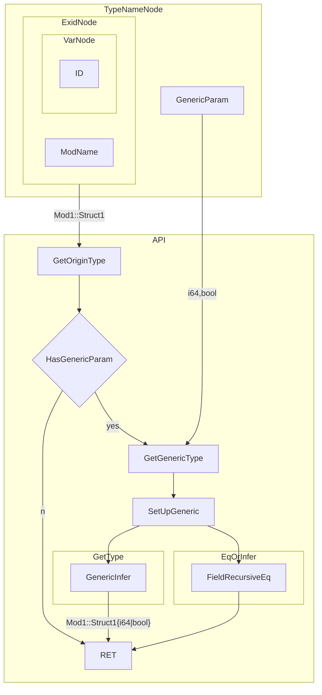

# Generic

```mermaid
graph TD
    DefStruct-->StructAddSymbol-->StructDef-->NodeEmit  
    subgraph DefStruct
        Def("Struct X< T >{y:T}")
    end
    subgraph StructAddSymbol
        subgraph SetUpGenericMap
            subgraph PLType::STType
                GenericMap
                Fields
            end
            subgraph PLType::Generic
                CurrentType
            end
            None
            EmptyVec("vec![]")
            CurrentType-->None
            Fields-->EmptyVec
            GenericMap--T-->PLType::Generic
        end
        %% GenLLVMCode
        subgraph GenLLVMCode
            Code("生成占位符，不带泛型签名，A = type {}")
        end
        AddType("ctx.add_type(X)")
        SetUpGenericMap-->GenLLVMCode-->AddType
    end

    subgraph StructDef
        AddGeneric(将泛型T加入ctx中泛型表)
        GetType("ctx.get_type(X)")
        FieldGetType
        subgraph EmitStructDef
            AddGeneric-->GetType--X-->FieldGetType--fields-->GenVtable
        end
    end

    subgraph NodeEmit
        HightLight
    end
    
```

```mermaid
graph TD
    subgraph StructInit
        Init("A<i64>{x:1+3}")
    end
```

```mermaid
graph TD
    subgraph TypeNameNode
        GenericParam
        subgraph ExidNode
            ModName
            subgraph VarNode
                ID
            end
        end
    end
    subgraph API
        ExidNode--Mod1::Struct1-->GetOriginType-->HasGenericParam{HasGenericParam}--yes-->GetGenericType
        HasGenericParam--no-->RET
        GenericParam--"i64,bool"-->GetGenericType-->SetUpGeneric
        SetUpGeneric-->GenericInfer
        SetUpGeneric-->FieldRecursiveEq
        subgraph GetType
            GenericInfer
        end
        subgraph EqOrInfer
            FieldRecursiveEq
        end
        GenericInfer--"Mod1::Struct1{i64|bool}"-->RET
        FieldRecursiveEq-->RET
    end
```