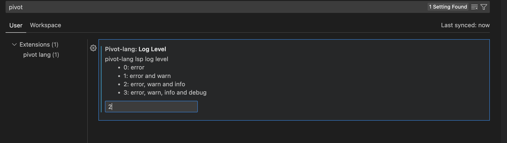

# 设计(design)

pivot-lang的lsp功能被内置于编译器中，它是以差量计算（incremental）为前提设计的。
目前整个lsp程序几乎是完全单线程的，但得益于我们的差量计算，它仍然具有不错的性能。  


## 1. 差量计算(incremental)

差量计算是指在编译器中，当源代码发生修改时，我们只对发生变化的部分进行重新分析，而不是对整个项目全部重新进行计算。  

pivot-lang的差量计算是基于rust的[salsa](https://github.com/salsa-rs/salsa)库实现的。
我们使用的版本是仍然处于预览阶段的`salsa_2022`。  

pl中的差量计算的最小复用单元是`Module`，即一个源文件。  

在plc作为lsp运行时，所有的lsp功能相关计算会在`TextDocumentEdit`事件发生时进行，之后如果不进行文本编辑，所有的
lsp请求都会直接从缓存中读取结果。  


## 2. 差量计算举例

假设我们有一个pl项目，其中有三个文件：`a.pi`、`b.pi`、`c.pi`。
其中`a.pi`和`b.pi`都引用了`c.pi`中的函数`f`，并且`a.pi`中还使用了`b.pi`中的函数`g`。  

此时，当我们用vsc打开此pl项目，vsc会启动plc进行分析。如果没使用差量计算，那么plc分析流程如下：  

```
尝试分析a.pi->
依赖c.pi->
分析c.pi->
返回继续分析a.pi->
依赖b.pi->
分析b.pi->
依赖c.pi->
分析c.pi->
返回继续分析b.pi->
返回继续分析a.pi->
完成
```

可以看到`c.pi`被分析了两次，这是不必要的。差量分析在这一步中可以优化掉第二次对`c.pi`的分析。  

然后，假设我们在`a.pi`中添加了一个字符，那么如果没采用差量分析法，所有的模块都会被重新分析一遍。而差量分析法只会对`a.pi`进行重新分析。  

接着，如果我们改动了`b.pi`，那么差量分析法会对`b.pi`和`a.pi`进行重新分析，而不会对`c.pi`进行重新分析。**即：每次修改文件时，只会对该文件以及依赖该文件的文件进行重新分析。**  

## 3. 验证差量计算是否正常工作

我们可以在vsc的选项中找到一个plc的`Log Level`选项，将它设置成`2`之后就能看到plc的`info`日志了。  
  

> 日志可以在vsc的outut中选择`pivot-lang language server`查看
> 

这里会在每次重新计算的时候输出对应的log。

## 一些坑点

### salsa lru与interned、tracked类型
`salsa`的lru缓存实际上缓存的key是`salsa`结构体的值，而不是实际值。也就是说，即使实际值一样，如果`salsa`结构体的值不同，那么缓存也会失效。  

所以，如果使用lru缓存的函数的输入是`tracked`类型的结构体，必须输入完全一致的对象才能触发缓存逻辑。
**如果你的结构体是`new`的则一定无法触发缓存逻辑**。  

因此，建议在需要缓存的函数中使用`interned`类型的结构体作为参数。因为`interned`每次`new`的时候会去db中检索值，
如果值已经存在则会返回已有的`salsa struct`，而不会`new`一个新的值。
