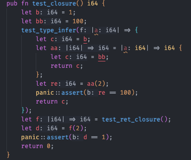

# Pivot Lang闭包使用说明

在Pivot Lang中，闭包是一种特殊的函数，它可以捕获和使用其外部作用域中的变量。以下是一些基本的闭包操作：

## 创建闭包

在Pivot Lang中，我们可以使用以下方式创建一个闭包：

```pivot
let a = |a: i64| => i64 {
    let c = b;
    return c;
};
```

这里，我们创建了一个名为`a`的闭包，它接受一个`i64`类型的参数，返回一个`i64`类型的结果。在闭包体内，我们使用了外部作用域中的变量`b`。

## 调用闭包

我们可以像调用普通函数一样调用闭包：

```pivot
let re = a(2);
```

这里，我们调用了闭包`a`，并将结果赋值给了变量`re`。

## 闭包的类型推断

在Pivot Lang中，一些情况下闭包的类型可以被推断出来。例如，我们可以将一个闭包作为函数的参数：

```pivot
test_type_infer(|a| => {
    let c = b;
    return c;
});
```

这里，我们将一个闭包作为`test_type_infer`函数的参数。这个闭包接受一个参数`a`，并返回一个结果。在闭包体内，我们使用了外部作用域中的变量`b`。

## 返回闭包的函数

在Pivot Lang中，函数可以返回一个闭包：

```pivot
fn test_ret_closure() |i64| => i64 {
    let b = 1;
    return |a: i64| => i64 {
        let c = b;
        return c;
    };
}
```

这里，我们定义了一个名为`test_ret_closure`的函数，它返回一个闭包。这个闭包接受一个`i64`类型的参数，返回一个`i64`类型的结果。在闭包体内，我们使用了函数作用域中的变量`b`。

## LSP特殊支持

所有闭包内部的被捕获变量都会被下划线标注，以方便区分


