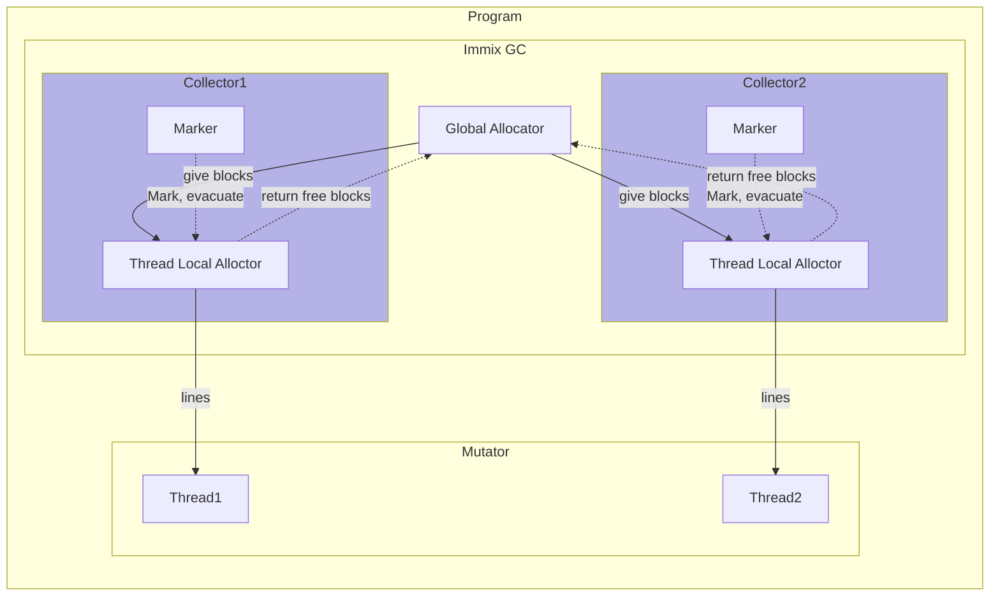
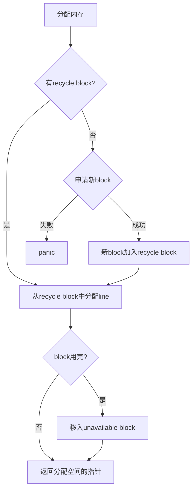

# pivot-lang immix gc

本文档将会描述pl使用的immix gc的一些实现细节与对外接口

```admonish
此页面仍在编写中，内容可能有疏漏
```

<!-- toc -->

## Overview

此gc是我们基于[immix gc论文](https://www.cs.utexas.edu/users/speedway/DaCapo/papers/immix-pldi-2008.pdf)实现的，
大部分的实现细节都与论文一致，对于一些论文没提到的细节我们自行进行了实现，参考了很多别的gc项目。该gc是一个支持多线程使用的、
基于shadow stack的，精确mark-region 非并发（Concurrency） 并行（Parallelism） gc。  


```admonish tip title="gc的并发（Concurrency）与并行（Parallelism）"
gc中并发和并行是两个不同的术语，并发gc指的是能够在应用不暂停的基础上进行回收的gc，
而并行gc指的是gc在回收的时候能够使用多个线程同时进行工作。一个gc可以既是并行的也是并发的，
我们的immix gc目前只具备并行能力
```
这里有一些创建该gc过程中我们主要参考的资料，列表如下：  

- [immix gc论文](https://www.cs.utexas.edu/users/speedway/DaCapo/papers/immix-pldi-2008.pdf)
- [playxe 的 immixcons（immix gc的一个rust实现，回收存在bug）-- 很多底层内存相关代码是参考该gc完成的，还有在函数头中加入自定义遍历函数的做法](https://github.com/playXE/libimmixcons)
- [给scala-native使用的一个immix gc的C实现](https://github.com/scala-native/immix)
- [康奈尔大学CS6120课程关于immix gc的博客，可以帮助快速理解论文的基本思路](https://www.cs.cornell.edu/courses/cs6120/2019fa/blog/immix/)


## General Description

本gc是为pl __定制的__，虽然理论上能被其他项目使用，但是对外部项目的支持**并不是主要目标**  

pl的组件包含一个全局的`GlobalAllocator`，然后每个`mutator`线程会包含一个独属于该线程的`Collector`，每个`Collector`中包含一个
`ThreadLocalAllocator`。在线程使用gc相关功能的时候，该线程对应的`Collector`会自动被创建，直到线程结束或者
用户手动调用销毁api。  

```admonish tip title="部分immix gc术语介绍"
**mutator**

mutator指使用gc的用户程序，在有些文档里也被指代为gc的client

**block**

block是immix中全局分配器分配的基础单位，每个block的大小为32KB

**line**

line是block中的基本单位，每个line长度为128B，每个block中包含256个line

**Global Allocator**

全局分配器，简称GA，分配内存以block为单位

**Thread Local Allocator**

线程本地分配器，简称TLA，分配内存以line为单位，在自身的block中分配，如果没有可用的block，会向全局分配器申请

**Collector**

线程本地的回收器，在每次gc开始的时候会运行标记和驱逐算法，然后通知Thread Local Allocator进行清扫

**Evacuation**

驱逐算法，是一种反碎片化机制

```

下方是使用immix gc的应用程序的工作流程图：



Immix GC由于分配以line为单位，在内存利用率上稍有不足，但是其算法保证了极其优秀的内存局部性，配合TLA、GA的设计也大大
减少了线程间的竞争。


## Allocation

### Global Allocator

GA是全局的，一个应用程序中只会有一个，负责分配block。在GA被初始化的时候，会向操作系统申请一大
块连续的内存，然后将其切分为block，每个block的大小为32KB。GA有一个`current`指针，指向
目前GA分配到的位置。当GA需要分配新block的时候，GA会返回当前`current`指针指向的内存空间，
并且将`current`指针向后移动一个block的距离。

GA同时维护一个`free`动态数组，用于存储已经被回收的block，当GA需要分配新block的时候，会先从`free`数组中
尝试取出一个block，如果`free`数组为空，才会分配新的block。

```admonish info
潜在的优化点：使用bitmap来记录block的使用情况，这样可以减少动态数组的开销
```
```admonish warning 
如果GA在分配新block的时候，发现`current`指针已经超出了初始申请的内存空间，会导致程序panic。这个行为应该在未来被改善
```

### Thread Local Allocator

TLA是线程本地的，每个线程都会有一个TLA，负责分配line，和进行sweep回收。

```admonish tip title="部分TLA用到的术语介绍"
- 小对象：小于line size的对象
- 中对象：大于line size，小于block size/4（8KB）的对象
- 大对象：大于block size/4的对象
- hole：block中一个未被使用的连续空间称之为hole
```

在每次回收的时候，TLA会将所有完全空闲的block回收给GA，所有部分空闲的block会被加入到`recycle`数组中，在之后的分配里被重复利用。
所有完全被占用的block会被加入到`unavailable`数组中，不会被重复利用。

TLA的小对象分配策略如下：



```admonish title="中对象、大对象分配策略"
中对象存在一个问题，就是如果他采用小对象的分配策略，在recycle block中分配line，那么分配过程中可能跳过
很多的小hole，而TLA的分配器在recycle block中分配的时候是**不回头**的，这样可能会导致：
- 内存碎片增加
- 分配时间变长

因此，中对象分配的时候只会找recycle block中的第一个hole，如果这个hole装不下它，TLA会直接申请新的block来分配该对象，
并且将这个block加入到recycle block中。

大对象分配不使用mark region算法，它使用特殊的bigobject allocator来分配，是传统的mark free算法。

因为程序中小对象的数量远远大于中对象和大对象，所以TLA的分配器会优先优化小对象分配，以增加性能
```

## Mark

Mark阶段的主要工作是标记所有被使用的line和block，以便在后续的sweep阶段进行回收。我们的mark算法是**精确**的，
这点对evacuation算法的实现至关重要。

精确GC有两个要求：
- root的精确定位
- 对象的精确遍历

我们的精确root定位是基于**Stack Map**的，这部分细节过于复杂，将在单独的文档中介绍。

对象的精确遍历是通过编译器支持实现的，plimmix将所有heap对象分类为以下4种：
- Atomic Object：原子对象，不包含指针的对象，如整数、浮点数、字符串等
- Pointer Object：指针对象，该对象本身是一个指针
- Complex Object：复杂对象，该对象可能包含指针
- Trait Object：Trait对象，该对象包含一个指针，在他的offset为8的位置，这个类型是专门配合pivot lang的trait设计的，是个特殊优化

对于Atomic Object，我们不需要遍历，因为他们不包含指针。

对于Pointer Object，我们只需要遍历他们的指针即可。

对于Complex Object，编译器需要在对象开始位置增加一个`vtable`字段，该字段的值指向该类型的遍历函数。此遍历函数由编译器生成，
其签名为：
```rust,ignore
pub type VisitFunc = unsafe fn(&Collector, *mut u8);
// vtable的签名，第一个函数是mark_ptr，第二个函数是mark_complex，第三个函数是mark_trait
pub type VtableFunc = fn(*mut u8, &Collector, VisitFunc, VisitFunc, VisitFunc);
```
在标记的时候，我们会调用对象的vtable对他进行遍历

对于Trait Object，我们需要遍历他指向实际值的指针

## Sweep

Sweep阶段的主要工作是：
- 回收所有未被标记的block
- 修正所有line的header
- 计算evacuation需要的一些信息

### 回收block

回收block的过程非常简单，我们只需要遍历所有的block，如果block的header中的`mark`字段为`false`，则将该block回收，统一返回给GA

### 修正line header

如果一个block被mark了，那么需要对block中的所有lineheader根据line是否被标记
进行修正。

### 计算evacuation信息

计算一个`mark`数组，该数组中下标为idx的元素值表示hole数量为idx的所有block的marked line的数量

## Evacuation

每次回收开始之前，我们会先判断是否需要进行反碎片化，目前的策略是只要recycle block>1就进行反碎片化。
```admonish info
优化点：如果处于内存用尽的紧急情况也应当进行evacuation，且threshold应当设置的更低
```

如果决定了需要进行反碎片化，那么我们会构建一个`available`数组，该数组中下标为idx的元素值表示hole数量为idx的所有block的可用line的数量，
然后我们按照洞的数量从大到小遍历`available`和`mark`数组，会定义一个`required`值，该值在每次遍历的时候加上`mark`数组中的值，
减去`available`数组中的值，如果某次循环后`required`值小于0，那么当前循环对应的hole数量+1就是我们evacuate的阈值（threshold）。
在此之后根据`threshole`将所有洞数量大于等于`threshole`的block标记为待evacuate。

真正的evacuation过程是在`mark`阶段一起完成的，我们会在遍历到处于待evacuate的block中的对象时，为它分配一个新的地址，并且
将它原地址的值替换为一个指向新地址的指针（forward pointer），且将line header中的`forward`字段设置为`true`。之后如果再次遍历到
该对象，收集器会修正指向原地址的指针的值。

```admonish tip title="多线程情况下驱逐算法的安全性"
在多线程情况下，是存在两个线程同时驱逐一个对象的可能的，在这种情况下一些同步操作必不可少，但是并不需要加锁。
我们通过一个cas操作来保证只有一个线程能够成功驱逐该对象。
```


## 性能

我们与bdwgc进行了很多比较，数据证明在大多数情况下，我们的分配算法略慢于bdwgc，与malloc速度相当，但是在回收的时候，我们的回收速度要快于bdwgc。
对于一些复杂的测试，在触发回收的策略相同的情况下，我们的单线程总执行时间慢于bdwgc（
测试采用shadow stack算法，维护shadow stack的额外开销较高），但是在多线程情况下，我们的总执行时间明显快于bdwgc（约3倍）。

如果你对性能感兴趣，可以在immix目录下使用`cargo bench`命令运行gc的基准测试。bdwgc测试代码基于复杂性考虑没有放在本仓库中，未来可能会单独在一个
仓库中放出。
