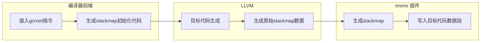

# Stak Map

<!-- toc -->

## Introduction

stackmap是一种用于实现精确gc的机制，简单来说它会在编译期间根据编译器提供的信息在编译后的目标文件
中插入栈变量的位置信息，这样在运行时gc扫描栈时就可以根据这些信息来确定栈上的变量的位置，从而完成精确回收。

stackmap方式的精确回收相比shadow stack的方式有以下优点：

- 无需维护gcroot链表，减少了开销
- 避免了运行时调用维护gcroot链表的函数形成的开销

但是同时它也有以下缺点：

- 跨平台存在劣势，各个平台的栈结构和可执行文件结构都有差异，stackmap过于底层，跨平台很复杂
- stackmap在回收的时候需要遍历函数调用栈，遍历栈的跨平台实现也很复杂，而且很多现有库都有bug

我们的stackmap功能基于llvm提供的一系列gc相关功能实现，llvm在这方面的文档十分混乱差劲，
甚至官网文档代码有一部分无法编译，还有很多地方严重过时与实际情况不符，因此全网都难找到基于llvm
实现stackmap功能的代码。本文档会尽量对这些部分进行说明。


## 细节实现

### stackmap格式和读取方式

llvm提供了一系列的gc相关api，首先是gc策略，我们可以给每个函数指定一个gc策略，并且llvm内置了一些gc策略。

为了性能和方便考虑，我们的gc实现了自己的gc策略（plimmix），此策略通过一个自定义llvm插件实现。其代码在 __immix/llvm__ 目录下
两个C文件一个定义了我们的GC策略，一个定义了我们的stackmap格式和生成方式。

我们的stackmap格式如下：
```
Header {
  i64  : Stack Map Version (current version is 1)
  i32  : function 数量
}
// 这里要对齐
Functions[NumFunctions] {
  u64 : Function Address
  i32 : Stack Size（单位是8字节）
  i32 : 需要压栈的函数变量数量（不同平台不一样，大部分平台前6个参数会用寄存器传）
  i32 : root数量
  i32 : safe point数量
  SafePoints[NumSafePoints] {
    u64: 地址
  }
  Roots[NumRoots] {
    i32: root的偏移(相对栈指针)
    i32: root的类型
  }
}
```



```admonish tip title="gc safepoint介绍"
safepoint说白了就是潜在的可以触发gc的点位，本来多用于进行多线程回收的同步：大部分gc
回收算法在回收时（全部或一部分时间）是不允许mutator运行的，这个时候需要暂停所有mutator
线程（stop the world），等回收完成后再恢复。使用safepoint机制的gc，在mutator线程运行到safepoint时会对
一个特殊flag进行检查，以判断自己是否需要暂停进行gc。在我们的immix gc中，
safepoint通常由其中一个工作线程在自己的safepoint发起，别的线程到达自己的下一个safepoint是会随即暂停，等到所有线程
都暂停的时候再进行回收。我们的safepoint目前是在所有malloc点位，不过我们的llvm插件目前会将所有函数调用点位都当作
safepoint处理。

safepoint对于stackmap至关重要，因为在回收时gc就是通过在stackmap中查询当前暂停对应的safepoint地址来获取当前栈中的root集的。在暂停的时候safepoint地址在当前栈帧的ip寄存器中。
```

我们的llvm插件会将stackmap信息生成到每个目标文件的数据段中，应用程序可以使用weak link的方式用对应的全局变量获取到这个数据标签对应的地址，然后就可以通过这个地址来获取到stackmap信息了。对应数据区域标签的命名规则是：`_GC_MAP_$source_file_name`，其中`$source_file_name`是对应llvm module中记录的的源文件名。

stackmap有多种读取方式，下方是我们使用的方式：

immix gc提供了`gc_init`函数，该函数接受一个stackmap指针，会加载该stackmap。我们的编译器
会在编译的时候为每个模块生成一个初始化stackmap的函数，该函数以一定的规则命名，之后
在生成主模块的的时候会自动在main函数开始处对这些初始化函数进行调用。

这部分代码理论上可以通过llvm插件自动完成，这部分以后应该会进行实现。实现此功能之后，我们的immix gc将会成为可以方便的给任何基于llvm的语言接入的gc。

`gc_init`函数主要会读取stackmap中的数据并且进行遍历，之后生成一个哈希表，用于快速的查找对应的safepoint地址。这个哈希表的key是safepoint地址，value是safepoint所在
函数的所有gcroot信息。

### 基于stackmap的精确root定位实现

为了遍历函数调用栈，我们使用`backtrace.rs`包，该包封装了一些平台相关的函数调用栈遍历的实现。
```admonish warning 
栈爬取的实现不同平台差异巨大，很容易出现bug。目前我们发现在mac aarch64上如果使用lld进行链接会导致该backtrace包出现
segment fault，这个问题目前使用ld替代lld进行规避。
```

遍历的时候通过`backtrace.rs`拿到当前ip寄存器的值，然后去我们构建的stackmap中查找到当前函数栈的root进行遍历，遍历完成后继续向上层函数栈遍历。
注意这里遍历的起点不在mutator代码中，而在gc代码中，所以遍历的开头和结尾查不到对应记录是完全正常的。

```admonish 
潜在优化点：其实从gc的函数到目标语言最底层函数的调用栈层数在运行时是固定的，所以这里其实可以优化，跳过前几个栈帧，直接从目标语言最底层函数开始遍历。
```

## 参考资料

1. [llvm stackmap 文档](https://llvm.org/docs/StackMaps.html)
2. [llvm gc 文档](https://llvm.org/docs/GarbageCollection.html)
3. [读取llvm默认生成的stackmap例子](https://github.com/KavinduZoysa/test-GCs)

