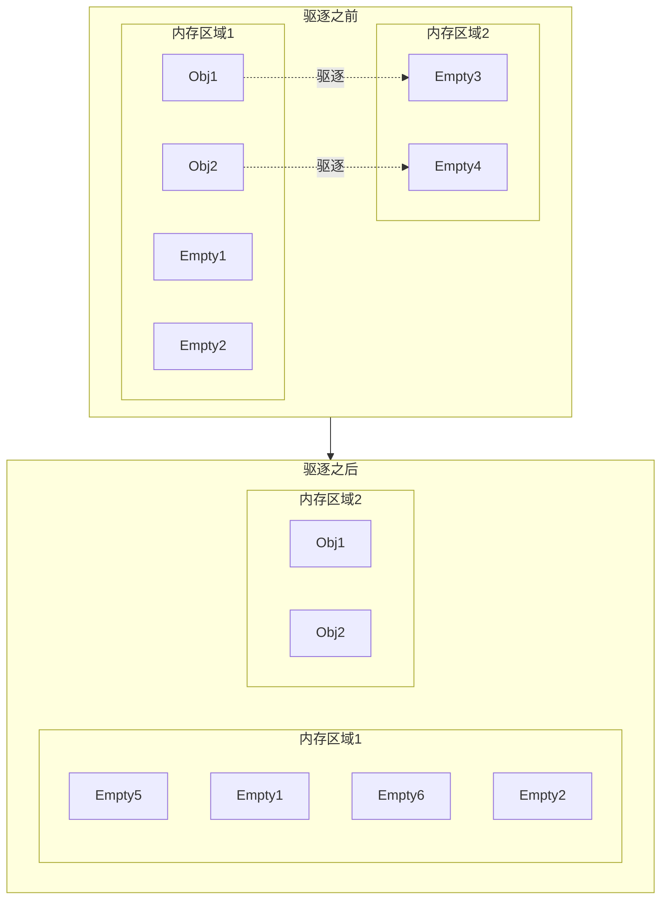
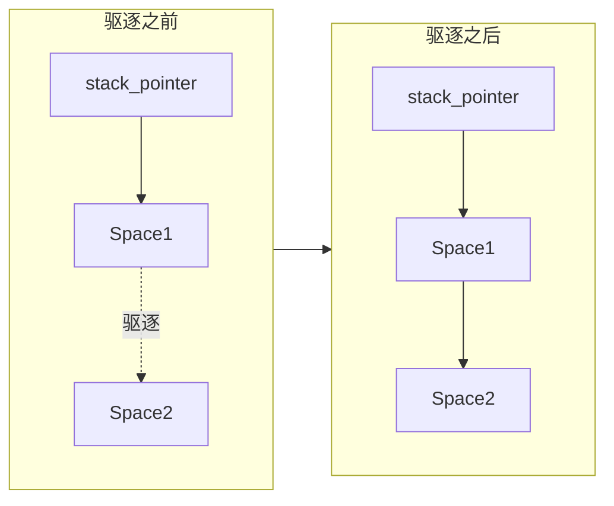
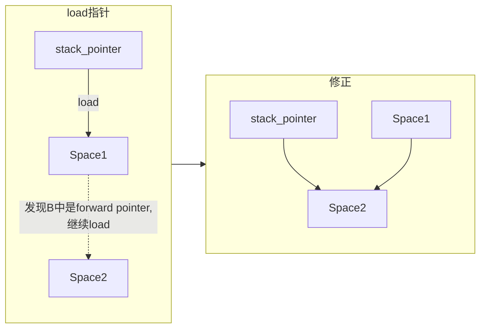
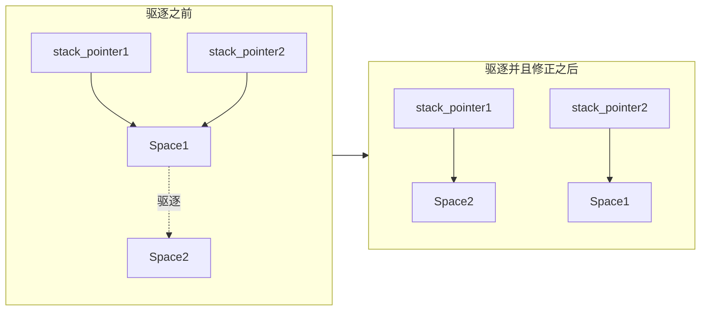

# Evacuation in practice

驱逐算法在实践中很容易造成内存安全问题，本文将会探讨常见的一些内存安全情况，
列举其他gc的一些解决方案以及他们的问题，以及PL所采取的解决方案。

```admonish
这个页面只包含驱逐算法的一部分信息，如果你对gc感兴趣，可以查看[immix](./immix.md)页面。
```


## 1. 前言--驱逐算法的简单介绍

在垃圾回收算法中，经常会面临内存碎片化的问题，这种问题会导致内存的利用率降低，空间局部性降低，从而导致程序的性能下降。
解决这个问题通常有两种思路：驱逐与压缩。

简单来说，驱逐算法是将内存中的对象移动到另一块空的内存区域，然后回收原本的内存区域。而压缩算法则是将内存中的对象重新
排列，使得内存中的对象最终连续排列。我们的Immix GC采用的是驱逐算法。




## 2. 驱逐算法的问题

驱逐算法虽然能够解决内存碎片化的问题，但是也存在一些缺点：

1. 性能损耗：驱逐算法需要将内存中的对象移动到另一块内存区域，这个过程会消耗一定的时间。
2. 内存安全：驱逐算法在移动对象的过程中，会导致原对象的引用失效，从而导致内存安全问题。

在immix中，驱逐和标记过程一起完成，总体性能损耗是很小的。而对于第二点，业界的主流做法是采用`forward pointer`。

即：在驱逐一个对象的时候，往这个对象原本的内存空间中写入一个指向新内存空间的指针，方便之后利用这个信息对
原对象的引用进行修正。



而修正引用的方法有多种，其中一种是使用读写屏障，这种方法的缺点是需要在每次读写的时候都要进行判断，会导致mutator严重的性能损耗。


这种做法称为自愈，他的一大优势是在一些情况下可以避免gc暂停。

我们的做法是在gc暂停的时候，在第一次驱逐的时候安装forward pointer，之后的标记过程中遇到forward pointer就进行修正，这样避免了读写屏障。同时immix的修正与mark一起进行，不需要多次遍历，相对来说效率很高。

但是这种做法需要编译器良好的配合来避免内存安全问题，稍有不慎就会segfault/bus error。

## 3. 内存安全注意事项与解决方案

几乎所有的内存安全问题都是由于引用没有正确更新。也就是说在gc回收驱逐了一部分内存之后，一部分引用还指向了原本的内存空间。


上图中，stack_pointer2指向的引用没有被修正，之后访问它指向的内存空间就可能会出错。

为了避免该问题，我们需要在编译时提供信息给gc，让gc能够知道所有指向堆变量的栈指针。这样gc就能够在驱逐的时候将这些指针进行修正。

具体来说，我们需要进行两项工作：

1. 所有llvm ir中 __独立存在的__ 堆变量都必须有个对应的stack alloca，并且该alloca要被注册为gcroot
2. 每次获取llvm值的时候，如果该变量为 __独立存在的__ 堆变量，必须从它对应的stack alloca中load出来


```admonish
所谓 __独立存在的堆变量__ 指的是llvm ir中作为左值存在，并且在下一次`GC_malloc`之后可能被使用的堆变量。为了保险起见，
目前在我们的代码中，所有`GC_malloc`的返回值，所有`bitcast`的结果，所有`load`的结果，以及所有`gep`结果都被认为是 __独立存在的堆变量__ 。
```

其中第二点已经在`get_llvm_value`中统一进行了处理，而第一点则需要在开发者在编写代码的时候自己进行注意。为了方便，llvmbuilder中增加了`create_root_for`函数
帮助开发者注册stackroot。


