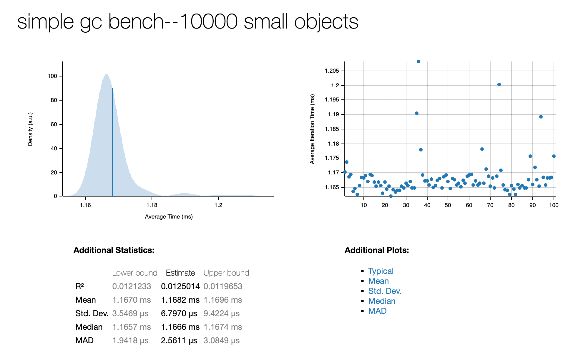
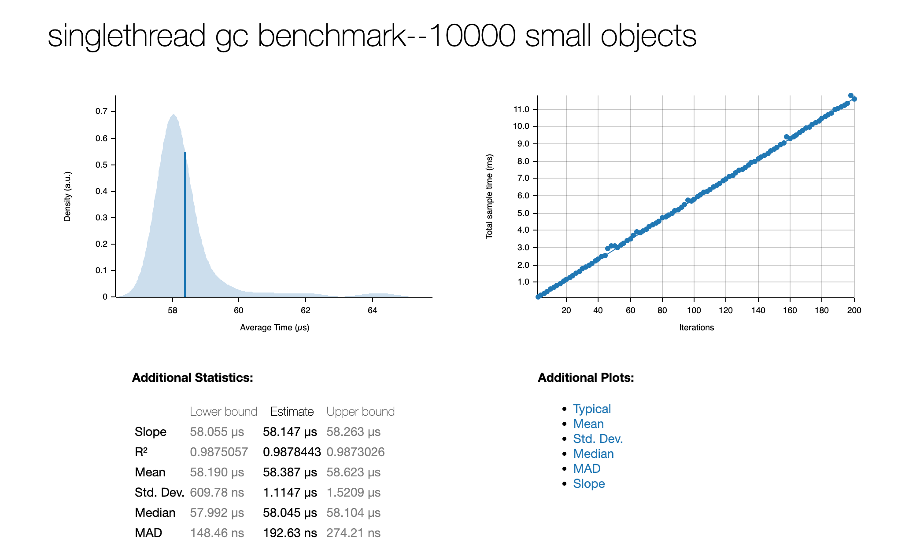

# GC

> ！WIP：此页面描述的功能仍然在实验性阶段，可能有些细节没有实现完毕。

pivot-lang 是一门使用gc进行内存管理的语言。  

pivot-lang 的gc目前是使用rust写的，采用一种叫做`immix`[\[1\]]的mark region算法。  

在以前的版本中，我们使用的是我们现在叫做`simple gc`的垃圾回收算法，他是一个简单的mark-sweep算法。
它由于性能问题和不支持多线程等原因最终被`immix`取代。不过我们仍然保留了它的代码，并且设置了一个编译开关（_feature:simple_gc_），可以在编译时手动选择使用该gc算法。

[\[1\]]: https://www.cs.utexas.edu/users/speedway/DaCapo/papers/immix-pldi-2008.pdf

## Simple GC

simple gc就和他的名字一样，[代码](https://github.com/Pivot-Studio/pivot-lang/blob/master/vm/src/gc/_simple_gc.rs)十分简单（算法实现大概100行）。它没有自己的allocator，直接
使用C中的`malloc`和`free`进行内存分配和释放。  

simple gc是一个[保守gc算法(Conservative Garbage Collection)](https://www.cs.cornell.edu/courses/cs6120/2020fa/blog/modern-gc/)，它没有能力精确的分辨出哪些内存是指针，哪些不是。因此它会试图将所有的内存都当做指针来处理。  

目前simple gc不建议在生产环境中使用，其代码保留下来是为了方便我们在未来的版本中进行性能对比，以及为未来用于教育目的做准备。  

## Immix GC

immix gc是一种mark region算法，它是一个精确的gc算法。但是请注意，它的精确建立在使用它
的项目提供的特殊支持之上。可以认为目前我们的immix gc实现 __是为pivot-lang量身定制__ 的。pl编译器为了和我们的immix gc配合，会在编译时专门生成一些额外的代码，如果缺少这些代码，immix gc将无法正常工作。
所以虽然理论上我们可以将我们的immix gc用到其他项目中，这么做的效益很可能并不是很高--
缺少编译器的支持，使用者将需要手动添加那些额外的代码。  

immix gc的实现代码在[这里](https://github.com/Pivot-Studio/pivot-lang/blob/master/immix)。它是天生支持多线程使用的，但是我们的pivot-lang目前还不支持多线程。  

## Benchmark

我们对两种gc算法进行了一些基准测试，事实证明immix gc的回收性能要比simple gc __快近20倍__。如果你对这些测试感兴趣，可以在项目根目录运行`make bench`查看immix的benchmark，或者运行`make bench-simple-gc`查看simple gc的benchmark。  

下方分别是simple gc和immix gc的benchmark结果，测试于2023年1月，commit 62b5c52c01e8133f5300e33a0131a50ba0c8d0de

