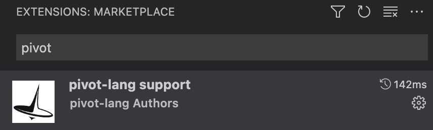

# Visual Studio Code support

我们建议开发者使用Visual Studio Code作为开发工具，因为我们提供了丰富的插件支持。  

## vsc插件安装
在vsc插件市场搜索`pivot-lang support`，安装第一个即可
  

> 注意：pivot-lang support插件依赖于plc命令，你必须确保plc文件安装路径在环境变量`PATH`中

## 支持功能
- [x] vsc debug
  - [x] 断点
  - [x] 变量表
    - [x] 函数参数
    - [x] 普通变量
- [x] 代码高亮
- [x] lsp支持
  - [x] 错误容忍
    - [x] parser错误容忍
    - [x] ast错误容忍
  - [x] 代码提示
    - [x] 普通变量
    - [x] 函数参数
    - [x] 函数
    - [x] 类型
    - [x] 模块
  - [ ] 代码跳转
    - [x] 普通变量
    - [x] 函数参数
    - [x] 函数
    - [x] 类型
    - [ ] 模块
  - [ ] 引用查找
    - [x] 普通变量
    - [x] 函数参数
    - [x] 函数
    - [x] 类型
    - [ ] 模块
  - [x] 语法高亮

